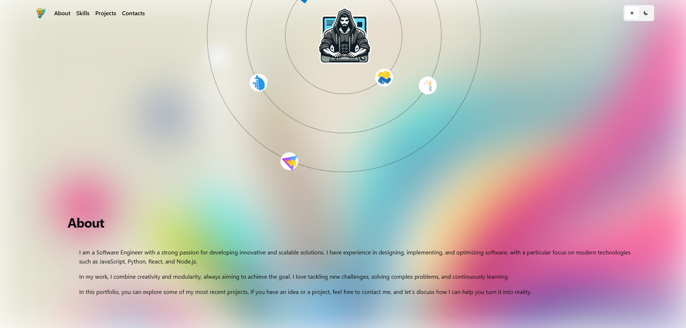

# **FE-React-Portfolio**

<p align="center">
  
</p>

[](./LICENSE)
[](#)


A modern portfolio application built using **React**, **TypeScript**, and **Chakra-UI**, showcasing modular design, theming capabilities, and reusable components. Designed for scalability and optimal developer experience.

<p align="center">
   <div style="display: flex; justify-content: center; align-items: center; gap: 10px;">
      
      
      
      
   </div>
</p>

## **Table of Contents**

- [Introduction](#introduction)
- [Features](#features)
- [Requirements](#requirements)
- [Installation](#installation)
- [Usage](#usage)
- [Project Structure](#project-structure)
- [Key Dependencies](#key-dependencies)
- [Testing](#testing)
- [License](#license)
- [Contributing](#contributing)
- [Contact](#contact)

## **Introduction**

**FE-React-Portfolio** is a modular, themeable portfolio application designed to showcase projects, skills, and professional information. It leverages modern frontend technologies and integrates well with tools like Storybook and GSAP for interactive storytelling and animations.

## **Features**

- ✅ Responsive design with light/dark themes
- ✅ Interactive project showcase with animations (powered by GSAP)
- ✅ Modular component-based structure for reusability
- ✅ Built-in Markdown rendering for project descriptions
- ✅ Storybook integration for component testing and preview
- ✅ Type-safe development using **TypeScript**
- ✅ State management with **Redux Toolkit**

## **Requirements**

Ensure the following are installed on your system:

- **Node.js**: `>= 20.18.0`
- **Yarn**: `>= 4.5.1`

## **Installation**

1. Clone the repository:
   ```bash
   git clone https://github.com/5h1ngy/fe-react-portfolio.git
   cd fe-react-portfolio
   ```

2. Install dependencies:
   ```bash
   yarn install
   ```

3. Start the development server:
   ```bash
   yarn start:dev
   ```

For a production build:
```bash
yarn build:prod
```

## **Usage**

### Core Features:
- **Project Showcase**: Interactive cards displaying project details, links, and thumbnails.
- **Markdown Support**: Render project descriptions dynamically using Markdown.
- **Dark Mode**: Built-in light/dark theming support using Chakra-UI.
- **Animations**: Smooth animations for transitions and interactive elements.

## **Project Structure**

```plaintext
src/
├── assets/          # Static assets (images, icons, etc.)
├── components/      # Reusable components
├── hooks/           # Custom React hooks
├── pages/           # Page-level components
├── store/           # Redux state slices
├── styles/          # Global styles and themes
├── utils/           # Helper functions and utilities
├── App.tsx          # Main app entry point
└── main.tsx         # Application bootstrap file
```

## **Key Dependencies**

- **React**: UI framework for building user interfaces
- **TypeScript**: Ensures type safety across the project
- **Chakra-UI**: Modular and accessible component library
- **Redux Toolkit**: State management solution
- **Storybook**: Component testing and interactive development
- **GSAP**: For advanced animations and transitions

## **Testing**

Run tests with:

```bash
yarn test
```

For component testing, launch Storybook:

```bash
yarn start:storybook
```

## **License**

This project is licensed under the [MIT License](./LICENSE).

## **Contact**

- **Author**: [5h1ngy](https://github.com/5h1ngy)  
- **Repository**: [GitHub](https://github.com/5h1ngy/fe-react-portfolio)  